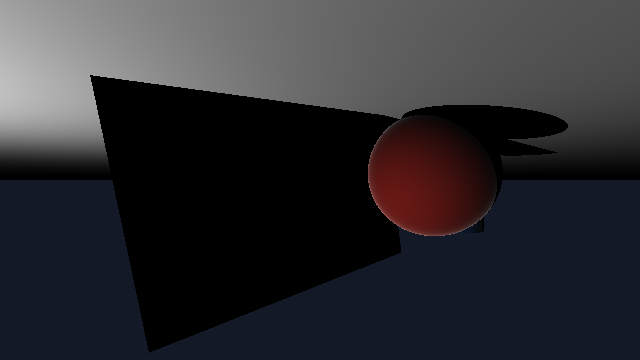

# Toy Tracer

A couple of experiments based on [astrofra/toy-tracer-c](astrofra/toy-tracer-c). 

Each directory contains an `AGENTS.md` file that contains instructions to build
a raytracer. The most esoteric the language for a raytracer, the better.

## Results

| Language  | Model      | Output                                        |
|-----------|------------|-----------------------------------------------|
| Reference | Sonnet 4.5 |  |
| Erlang    | Sonnet 4.5 (multiple iterations) |                   |
| C         | Sonnet 4.5 (oneshot) |                             |
| Ruby      | Sonnet 4.5 (oneshot) |                       |

## Notes

`.tga` images are converted using `ffmpeg -i output.tga output.png`
