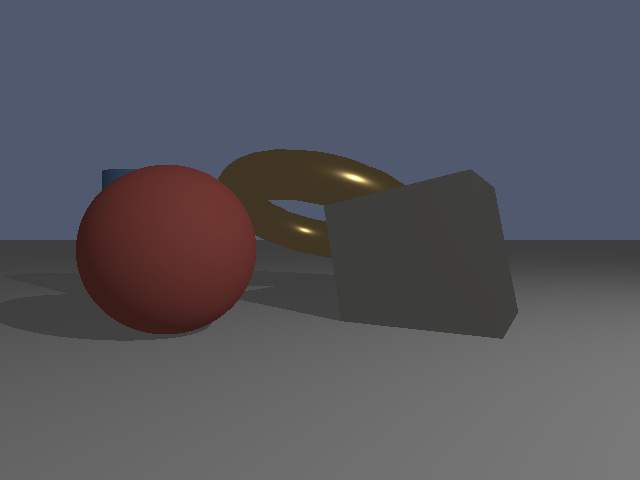

# Erlang Raytracer

A CPU-based raytracer written entirely in **pure Erlang** with zero external dependencies, by Claude Sonnet 4.5.
The implementation is based on the content of the `AGENTS.md` file.

## But... why?

I... am sorry. This should not exist.

I just wanted to know whether it was possible for Claude Sonnet 4.5 to one-shot the implementation of a Raytracer in a language that should not be used for that.

The project is based on [astrofra/toy-tracer-c](https://github.com/astrofra/toy-tracer-c) which is an implementation by an Agent, in C.

The outputs are dramatically different. The erlang implementation doesn't seem to handle lightning and material correctly.

Reference C output:

Erlang output:

## Quick Start

1. Install erlang. (`brew install erlang` is a nice way to do it if you have Homebrew installed)
2. run `./build.sh`
3. Open `output.tga`
